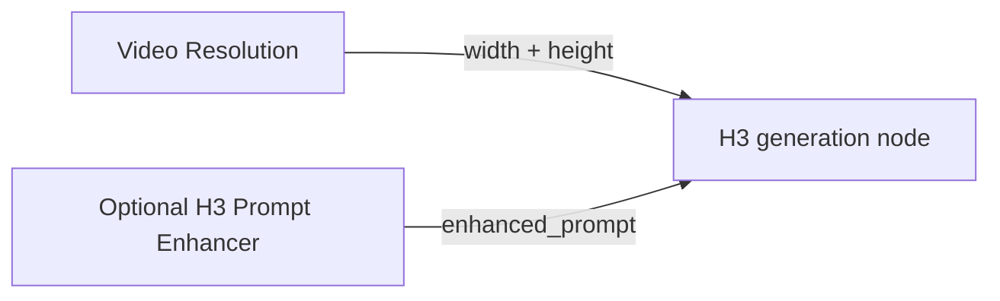

# ComfyUI Video Resolution

**Choose a video canvas. Get dimensions aligned to your model.**

One node for short-edge presets, megapixel budgets and custom dimensions—with
profiles for **MiniMax H3, Wan, LTX, Hunyuan Video, CogVideoX and Mochi**.
Outputs `width`, `height` and `resolution_str`. No models to download, no extra
Python dependencies, and no GPU required for the selector.

[Quick start](#quick-start-minimax-h3) · [Presets](#choose-a-sizing-mode) ·
[Model profiles](#model-profiles) · [Inputs](#inputs-and-outputs) · [FAQ](#faq)

## Installation

**ComfyUI Manager:** search for `comfyui-video-resolution`, install, then restart
ComfyUI and refresh the browser.

**Manual installation:**

```bash
cd ComfyUI/custom_nodes
git clone https://github.com/hyukudan/comfyui-video-resolution.git
```

Requires Python 3.10+. Add **Video Resolution** from the node menu; it is in the
`video` category. Search aliases include `h3`, `minimax`, `video size` and `ltx2`.

> The Git repository is already listed in Manager. The first Registry release
> under ID `video-resolution` is being prepared; the features below describe
> version **1.2.0**. Avoid installing a second copy alongside the existing one.

## Quick start: MiniMax H3

1. Add **Video Resolution** and set `model_profile` to **MiniMax H3**.
2. Set `resolution` to **H3 Native (768p)**, `aspect_ratio` to **16:9 (Widescreen)**,
   and keep `scale = 1x` and `swap = false`.
3. Connect `width` and `height` to the corresponding inputs of your H3 generation
   node. The result is **1344×768** with the default `floor` rounding.



The selector calculates dimensions; it does **not** create latents, resize reference
images, crop video, or configure generation. Your downstream node handles those jobs.

For a smaller test canvas, choose **0.3 MP** and `rounding_mode = nearest`:
the same 16:9 H3 setup produces **736×416**. Lower pixel counts reduce the spatial
workload, but are not a promise of a particular VRAM usage, speed or image quality.

## Choose a sizing mode

| You want… | Choose | How it works |
|---|---|---|
| H3's native canvas | **H3 Native (768p)** + **MiniMax H3** profile | 768 short edge, 1344×768 area budget, then native 32-pixel alignment |
| Similar pixel area across aspect ratios | **0.3, 0.5, 0.7 or 1.0 MP** | Derives width/height from area and aspect ratio |
| Your own pixel budget | **Custom MP** | Set `custom_megapixels` between 0.01 and 16 MP; uses the same calculation as the fixed MP presets |
| A familiar short-edge size | **480p, 540p, 720p, 768p, 1080p, 1440p, 2160p or 4320p** | Sets the shorter dimension, then derives the longer one |
| Your own width and height | **Custom → manual** | Uses both custom dimensions; ignores `aspect_ratio` |
| A known width | **Custom → from_width** | Derives height from width and aspect ratio |
| A known height | **Custom → from_height** | Derives width from height and aspect ratio |

All modes then apply `scale`, the selected model's alignment and `swap`.
**Custom dimensions are still scaled and aligned**; “manual” does not bypass model rules.

For example, **Custom MP = 0.4**, **MiniMax H3**, **16:9** and **nearest** produces
**832×480** at 1x. The MP field appears only in Custom MP mode. Its limits apply
before scale/alignment; they are not limits on model memory or final pixel area.

Available aspect ratios: **1:1, 16:9, 19:9, 2.39:1, 9:16, 4:3, 5:4, 3:4, 4:5,
21:9, 9:21, 3:2 and 2:3**. Portrait presets use the same short-edge convention as
landscape presets.

### Megapixels, scaling and rounding

- **1 MP = 1,000,000 pixels**, matching the H3 Prompt Enhancer. Some core ComfyUI
  sizing nodes use 1024² pixels per MP instead.
- MP presets are approximate targets, **not strict memory or pixel caps**.
  `floor` rounds each dimension down; `nearest` picks the closest aligned dimension;
  `ceil` rounds up. Alignment can slightly change the aspect ratio.
- `scale` multiplies **both dimensions**: 0.5x gives roughly one quarter of the
  original pixel area, while 2x gives roughly four times the area.
- For H3 Native, native alignment happens first, then scale and final model alignment.
  Its area budget applies **before** rounding; the aligned canvas can slightly exceed it.

For compatibility, short-edge and Custom modes truncate fractional pixels after
scaling and before alignment. MP modes keep those fractions until alignment.
Consequently, legacy `ceil` can differ from rounding the untruncated scaled size.

## Model profiles

Profiles set spatial alignment. They do not select a model, enforce its trained
resolution range, or set duration, FPS or frame count.

| Profile | Width/height multiple | Intended use |
|---|---:|---|
| **MiniMax H3** | **32** | H3's 16× visual VAE followed by 2×2 spatial patchification |
| **Wan 2.2 TI2V 5B** | **32** | The 5B TI2V VAE family |
| Wan 2.x | 16 | Existing Wan 2.1 / Wan 2.2 14B sizing |
| Hunyuan Video | 16 | Original Hunyuan Video |
| Hunyuan Video 1.5 | 16 | Native ComfyUI node's spatial step |
| LTX Video / LTX2 | 64 | Conservative alignment for LTX workflows |
| LTX 2.3 | 64 | Same alignment, explicit model label |
| CogVideoX | 16 | Existing CogVideoX profile |
| Mochi | 64 | Existing Mochi profile |
| Custom | 8, 16, 32 or 64 | Manual `divisible_by` and optional legacy `add_one` |

**Every named profile disables `add_one`.** Temporal rules such as “4n+1 frames”
must not be applied to width or height. Selecting a resolution preset does not
automatically change the model profile—select **both** for H3.

## H3 examples

All examples use `model_profile = MiniMax H3`, `scale = 1x` and `swap = false`.

| Resolution | Aspect ratio | Rounding | Output |
|---|---|---|---|
| H3 Native (768p) | 16:9 | floor | 1344×768 |
| H3 Native (768p) | 9:16 | floor | 768×1344 |
| H3 Native (768p) | 1:1 | floor | 768×768 |
| H3 Native (768p) | 4:3 | floor | 1024×768 |
| H3 Native (768p) | 21:9 | floor | 1536×672 |
| 0.3 MP | 16:9 | nearest | 736×416 |
| 0.5 MP | 16:9 | nearest | 928×544 |
| 0.7 MP | 16:9 | nearest | 1120×640 |
| 1.0 MP | 16:9 | nearest | 1344×736 |
| 768p | 21:9 | floor | 1792×768 |

**H3 Native and plain 768p are different:** the native mode also applies an area
budget, so an ultrawide canvas becomes shorter than 768 pixels. It follows ComfyUI's
[`adapt_canvas`](https://github.com/Comfy-Org/ComfyUI/blob/master/comfy_extras/nodes_minimax_h3.py).
Higher resolutions remain selectable, but are not H3's separate hosted 2K regeneration pipeline.

### Live size preview

The panel below the controls shows the **final width × height**, **actual MP** and
**effective alignment**. For example: `736 × 416` and `0.306 MP · multiple of 32`.
It uses the same Python calculation as execution through your ComfyUI server;
no separate browser rounding rules or external services are involved.

Changes are debounced briefly. If any input is connected from another node, the
panel shows **Connected inputs** instead of presenting local widget values as the
result. Disconnect the inputs to resume the live preview. Values from connections
are still handled normally during graph execution.

The panel is informational: it adds no output sockets or saved widget values.
For the legacy Custom-profile offset it explicitly shows `grid 32 + 1 (legacy)`
rather than claiming the final dimensions are divisible by 32.

### With MiniMax H3 Prompt Enhancer

The [Prompt Enhancer](https://github.com/hyukudan/ComfyUI-MiniMax-H3-Prompt-Enhancer)
is optional. Send its `enhanced_prompt` to H3 and use **one source of dimensions**:
either the enhancer's width/height outputs or this selector's outputs.

For matching dimensions, use **MiniMax H3 + 1x + swap=false** and the same aspect
ratio in both nodes. Their shared ratios are **16:9, 9:16, 1:1, 4:3, 3:4 and 21:9**;
the enhancer's `auto` falls back to 16:9, not the aspect of an input image.

H3 Native matches the enhancer's Auto sizing in **0.15.0**; MP presets with `nearest`
match its custom MP sizing. **0.15.0 is being prepared and is not yet published**;
Registry version **0.14.1 uses older sizing rules**. The packages install separately
and do not import each other.

## Inputs and outputs

| Input | Purpose |
|---|---|
| `resolution` | Native, short-edge, MP or Custom sizing |
| `aspect_ratio` | Frame shape; ignored in Custom/manual |
| `scale` | 0.25x, 0.5x, 0.75x, 1x, 1.25x, 1.5x or 2x |
| `model_profile` | Chooses the spatial alignment rules |
| `custom_mode` | manual, from_width or from_height; only for Custom resolution |
| `custom_width` | Width reference; unused in from_height |
| `custom_height` | Height reference; unused in from_width |
| `divisible_by` | Manual alignment; only for the Custom model profile |
| `rounding_mode` | floor, nearest or ceil; floor is the existing default |
| `add_one` | Legacy +1 after alignment; only for the Custom model profile |
| `swap` | Swaps the final dimensions |
| `custom_megapixels` | Optional, last input; 0.01–16 MP, default 0.5; used only in Custom MP |

| Output | Type | Example |
|---|---|---|
| `width` | INT | `1344` |
| `height` | INT | `768` |
| `resolution_str` | STRING | `1344x768` |

The node returns the final dimensions when the graph executes. `resolution_str`
can also feed a compatible text display; the live panel is separate from these outputs.

## FAQ

**Why does 720p give me 704 pixels?** 720 is not divisible by 64. The existing
default—LTX profile plus floor rounding—therefore returns 1280×704 for 16:9.
Use the profile for your actual model; use `nearest` if you prefer the closest
aligned size rather than always rounding down.

**Where did the Custom controls go?** The node shows only controls used by the
selected mode and adjusts its height automatically:

- **Presets:** aspect ratio, scale, model profile, rounding and swap.
- **Custom/manual:** width and height replace the aspect ratio.
- **Custom/from_width or from_height:** aspect ratio plus the reference dimension.
- **Custom MP:** aspect ratio plus the megapixel budget.
- **Custom model profile:** also shows `divisible_by` and the legacy `add_one`.

Hidden values remain saved and return when you switch back. Connected inputs remain
accessible; if a mode selector is connected, its potentially relevant controls stay
visible because the mode will be resolved during execution. This compact layout uses
ComfyUI's current widget visibility support; refresh the browser after updating.

**Why does the preview ask me to restart?** The preview endpoint is registered when
ComfyUI loads the node. After updating, restart ComfyUI and refresh the browser.
If the server cannot be reached, the panel says Preview unavailable rather than
leaving an old size visible.

**Why did Custom add one pixel?** The legacy Custom-profile default is
`add_one = true`. Set it to **false** unless your downstream workflow explicitly
requires that behavior. Named profiles always keep it off.

**Can I use 4K or 8K with any model?** These are size presets, not model capability
claims. The selector neither checks available VRAM nor guarantees that the generator
will accept or perform well at that resolution. Start with the model's documented canvas.

## Compatibility and development

Version 1.2.0 keeps `VideoResolutionNode`, all previous combo values, the existing
input order/defaults and all three output sockets. `custom_megapixels` is optional
and appended after the old inputs; it defaults to 0.5 when omitted. Existing selector
workflows do not need migration. The calculation uses only the Python standard library;
the preview route uses ComfyUI's existing web server dependencies.

Run the tests from the repository root:

```bash
python -m unittest discover -s tests -v
node --test tests/test_ui.mjs
```

Sizing references:
[H3 architecture](https://github.com/MiniMax-AI/MiniMax-H3#h3-vae),
[ComfyUI H3](https://github.com/Comfy-Org/ComfyUI/blob/master/comfy_extras/nodes_minimax_h3.py),
[Wan](https://github.com/Comfy-Org/ComfyUI/blob/master/comfy_extras/nodes_wan.py),
[Hunyuan Video](https://github.com/Comfy-Org/ComfyUI/blob/master/comfy_extras/nodes_hunyuan.py).

<details>
<summary>Maintainers: publishing to Comfy Registry</summary>

The default branch is `master`, Registry ID is `video-resolution`, and publisher
is `hyukudan`. Configure the repository secret `REGISTRY_ACCESS_TOKEN` for that
publisher. The publish workflow runs tests before upload when `pyproject.toml`
changes on master, or when manually dispatched. Each release needs a new semantic
version. Verify that it becomes active in Registry after the workflow completes.

Manager already lists the Git repository; do not submit a duplicate registration.
See the [official publishing instructions](https://docs.comfy.org/registry/publishing).

</details>

## License

[MIT](LICENSE).
